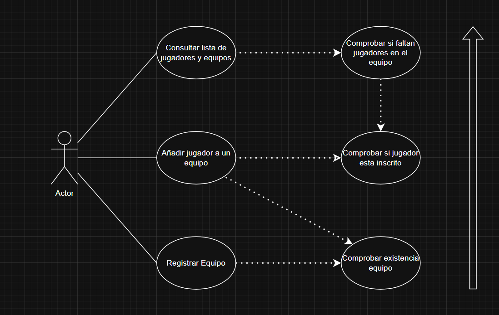
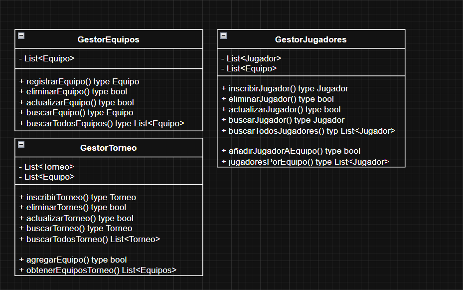

# AD3_UML

# Sistema de Gestión de Torneos de eSports
## Autor
Mikel Barberena Ruiz
@mikelbarbe

## Descripción del Proyecto
https://github.com/mikelbarbe/AD_3_UML

Este proyecto implementa un sistema de gestión de torneos de eSports utilizando UML para el modelado y Java para la implementación.

## Diagramas UML
### Diagrama de Casos de Uso

### Diagrama de Clases

## Instalación y Ejecución
1. Clonar el repositorio:
'git clone https://github.com/mikelbarbe/AD_3_UML.git'

## Justificación del diseño
Por qué se eligió esa estructura y cómo se organizan las clases.
- Entidades:
    Equipo: Representa a los equipos deportivos, con atributos clave como id, nombre, ciudad, categoria y una lista de jugadores. Esto permite gestionar todos los equipos y sus jugadores de manera organizada.

    Jugador: Representa a un jugador, con atributos como idJugador, nombre, fechaNacimiento, posicion y numero, lo que facilita su identificación y gestión.

    Torneo: Almacena información sobre los torneos, como idTorneo, nombre, fechaInicio, fechaFin y una lista de equipos, lo que permite gestionar los torneos y sus equipos participantes.

- Clases de Control:
    GestorEquipos: Gestiona operaciones sobre los equipos, como registrar, eliminar, actualizar y buscar equipos. Centraliza la lógica de los equipos.

    GestorJugadores: Controla las operaciones sobre jugadores, incluyendo su registro, eliminación, actualización y la asociación de jugadores a equipos.

    GestorTorneo: Maneja las operaciones relacionadas con torneos, como registrar, eliminar, actualizar torneos y agregar equipos a un torneo, garantizando la correcta asociación de equipos y torneos.

## Razonamiento de Casos de Uso
1. Registrar un Equipo
Antes de registrar un equipo, se verifica si ya existe en el sistema para evitar duplicados. Si el equipo ya está registrado, la operación se rechaza.

2. Añadir Jugador a un Equipo
Al añadir un jugador, se verifica que el equipo exista y que el jugador no esté ya inscrito en ese equipo. Esto previene duplicados y asegura que los datos sean consistentes.

3. Consultar Lista de Jugadores y Equipos
Se comprueba que todos los equipos tengan jugadores asignados correctamente y que los jugadores estén inscritos en equipos. Esto garantiza que la información mostrada sea precisa y completa.

## Conclusiones
Sobre el aprendizaje obtenido:
En esta actividad, he aprendido a utilizar diagramas de casos de uso para identificar funcionalidades del sistema y las interacciones de los actores. Además, he comprendido cómo estructurar el sistema con diagramas de clases, identificando clases de entidad y control.Por otro lado he aprendido a estructurar un proyecto de Java antes de empezar a programar y de este modo poder organizarme de mejor manera.
